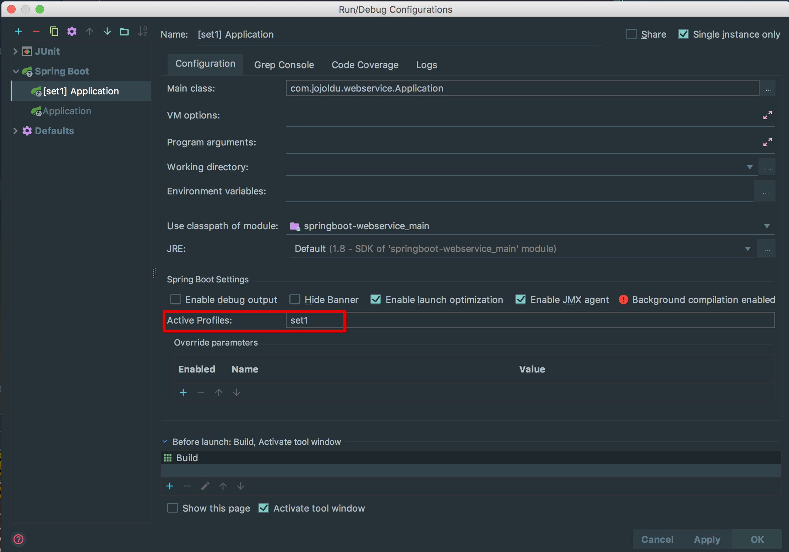
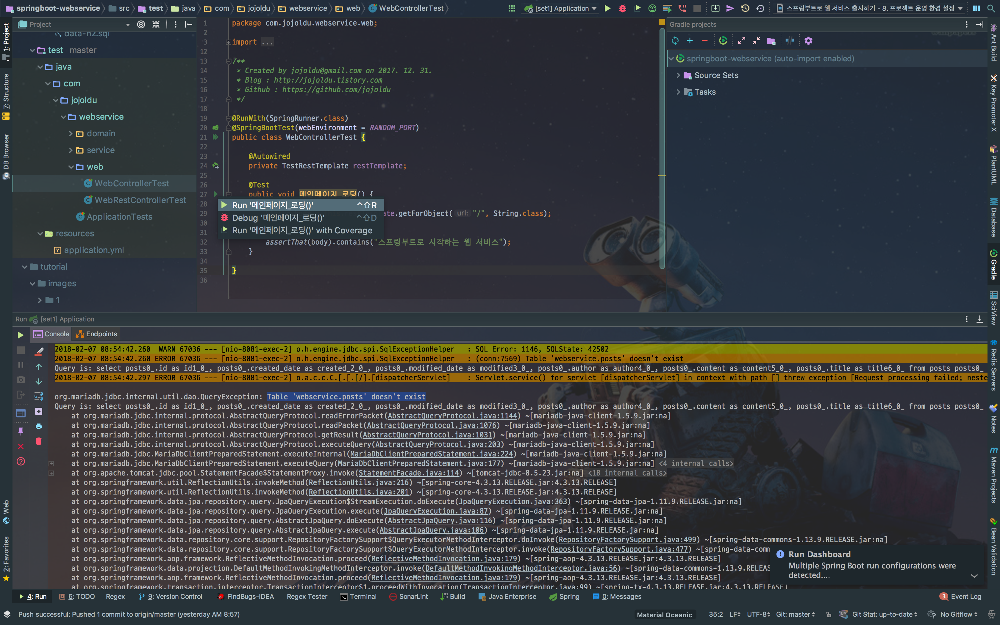
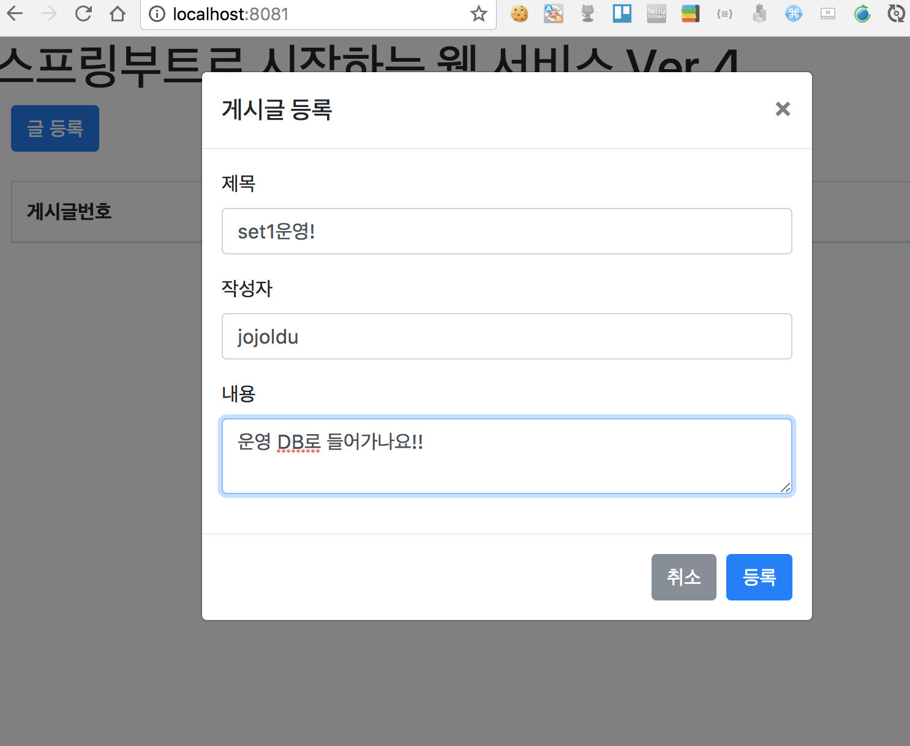
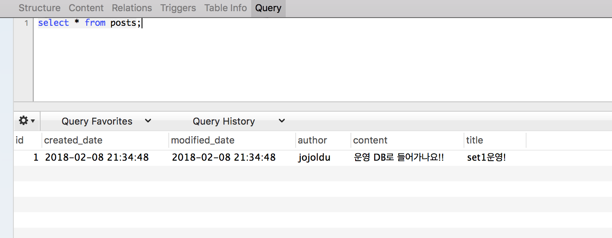

# 8. 운영 환경 설정

저번시간까지 배포 환경에 대한 설정을 진행했습니다!  
이제는 서비스 중단 없이 배포가 가능한 상태가 되었는데요.  
이대로 서비스 하면 될까요?  
뭔가 하나 놓친게 있지 않으신가요?  
현재는 **스프링부트에서 실제 운영 DB의 설정을 갖고 있지 않습니다**.  
즉, 아직은 프로젝트가 AWS RDS와 연동된 상태가 아닙니다.  
그래서 이번 시간엔 스프링부트와 운영 DB 접근 등의 실제 운영환경 설정을 진행하겠습니다.  


## 8-1. 운영 DB 접근

저번 시간에 저희는 운영 YAML (```real-application.yml```)만 별도로 분리해 EC2 서버에 추가했습니다.  
간단하게 생각하면 운영 DB 접속 정보는 ```real-application.yml```에 추가하면 됩니다.  
하지만 이렇게 될 경우 **set1, set2 설정에 같은 내용을 반복 추가**해야되고, **변경이 있을 경우 2개 profile 코드를 모두 고쳐**야 합니다.  
추가로 운영 레디스 접근 혹은 외부 운영 API 등의 접속정보도 **항상 set1과 set2에 복사 & 붙여넣기**를 반복해야합니다.  
그래서! 이부분을 좀 더 개선해보겠습니다.  

### 8-1-1. 운영 DB 드라이버 의존성 추가

제일 먼저 할일은 운영 DB의 드라이버를 추가하는 것입니다.  
현재는 H2 드라이버만 있기 때문에 build.gradle에 아래와 같이 Maria DB 드라이버를 추가합니다.

```groovy
compile("org.mariadb.jdbc:mariadb-java-client")
```

Database 작업은 이게 끝입니다!  
바로 다음을 진행합니다.

### 8-1-2. YAML(.yml) 수정

이번에 사용할 기능은 스프링부트의 [Adding active profiles](https://docs.spring.io/spring-boot/docs/current/reference/html/boot-features-profiles.html#boot-features-adding-active-profiles) 입니다.  
yml에서 특정 Profile을 **포함**시켜 설정을 공유하는 개념정도로 보시면 됩니다.  
  
우선 **프로젝트 내부의 application.yml**을 조금 수정해보겠습니다.  
기존에 real-application.yml에 있던 set1, set2 내용을 그대로 복사해서 붙여넣습니다.  
  
> Tip)  
real-application.yml은 Application.java에 위치가 등록되있습니다.  
저와 똑같이 진행하신 분들은 ```/app/config/springboot-webservice/real-application.yml```로 되어있습니다.)

```yml
spring:
  profiles:
    active: local # 기본 환경 선택

# local 환경
---
spring:
  profiles: local
  datasource:
    data: classpath:data-h2.sql # 시작할때 실행시킬 script
  jpa:
    show-sql: true
    hibernate:
      ddl-auto: create-drop
  h2:
    console:
      enabled: true

# 운영 환경
---
spring:
  profiles: set1
server:
  port: 8081

---
spring:
  profiles: set2

server:
  port: 8082
```

set1과 set2 설정이 application.yml에 포함되었는데요.  
이제 여기서 Database 설정을 포함시켜보겠습니다.  
먼저 기존에 ```/app/config/springboot-webservice/real-application.yml```을 Database 내용만 가지도록 아래와 같이 변경합니다.

```yml
---
spring:
  profiles: real-db
  datasource:
        url: jdbc:mariadb://rds주소:포트명(기본은 3306)/database명
        username: db계정
        password: db계정 비밀번호
        driver-class-name: org.mariadb.jdbc.Driver
```

Database 설정만 담아서 **real-db**라는 profile로 등록하였습니다.  
앞으로는 real-db profile을 추가하면 바로 운영 Database에 접속할수 있게 됩니다.
더불어 Redis나 Queue와 같은 저장소 정보도 마찬가지로 real-redis, real-queue 등으로 관리할 수 있겠죠?  
  
자 그럼 실제로 한번 이 Profile을 set1, set2에 한번 적용해볼까요?  
프로젝트 내부의 application.yml을 다음과 같이 변경합니다.  

```yml
spring:
  profiles:
    active: local # 기본 환경 선택

# local 환경
---
spring:
  profiles: local
  datasource:
    data: classpath:data-h2.sql # 시작할때 실행시킬 script
  jpa:
    show-sql: true
    hibernate:
      ddl-auto: create-drop
  h2:
    console:
      enabled: true

# 운영 환경
---
spring.profiles: set1
spring.profiles.include: real-db

server:
  port: 8081

---
spring.profiles: set2
spring.profiles.include: real-db

server:
  port: 8082
```

위의 ```spring.profiles.include```는 **해당 profile을 실행시킬땐 특정 profile을 포함**시킨다는 내용입니다.  
즉, set1을 profile로 실행시킬때 real-db까지 함께 실행된다는 이야기입니다.  
자! 그럼 이제 잘 적용되는지 한번 실행해보겠습니다.  
IntelliJ를 기준으로 스프링부트 실행시 **Active Profiles**를 set1로 지정해서 실행해봅니다.



> Tip)  
Eclipse에서 특정 Profile을 지정해서 실행시키는 방법은 [링크](https://stackoverflow.com/questions/39081945/how-to-specify-spring-profiles-active-when-i-run-mvn-install)를 참고해보세요!

뭔가 잘 실행되는것처럼 보이다가!  
에러가 발생했습니다.


에러를 자세히 보시면 **Table 'webservice.posts' doesn't exist**가 보입니다.  
posts 테이블이 database에 존재하지 않는다는 내용입니다.  
웬지 운영 DB에 접근했는데 **운영 DB에 Entity 클래스들과 맵핑될 테이블이 없는것**처럼 느껴지시지 않나요?  
자 그럼 운영 DB에 한번 테이블을 생성해보겠습니다.

### 8-1-3. 운영 DB에 테이블 생성

기존까지는 H2 DB를 로컬에서 사용하면서 프로젝트가 실행되면 **Entity 클래스를 기반으로 자동으로 테이블이 생성**되도록 했는데요.  
운영 DB에선 그렇게 자동 생성 옵션을 사용하는게 위험하기 때문에 직접 테이블을 생성하겠습니다.  

> Tip)  
운영도 초기 테이블 생성시에만 잠깐 create-drop 옵션을 켜놓으면 되지 않을까 하실텐데요.
**git 브랜치를 롤백해서 배포하다가 해당 옵션이 적용된채**로 나간다던지,  
실수로 **해당 옵션을 삭제안했다**던지 등등으로 다시 생성되면 안되는 시점에 다시 생성되서 기존 데이터가 전부 날라가는 일을 몇번 보게되서 해당 옵션을 운영 yml에 넣는건 아에 고려하지 않는걸 권장하게 되었습니다.

근데 클래스를 보고 테이블을 만들기에는 실수할여지도 많고, 어려운점이 많겠죠?  
그래서 JPA의 도움을! 받겠습니다.  
예전에 만들어 놓은 테스트 클래스 중 ```WebControllerTest```의 테스트를 한번 실행합니다.  



그러면 아래와 같이 실제 DDL 쿼리가 출력됩니다!


이 쿼리를 복사해서 실행하면 좋겠지만, 보시면 뭔가 MySQL 쿼리와는 다른 형태죠?  
(```auto_increment```대신에 ```generated bby default as identity```가 있는 등등)  
이는 테스트 메소드에서 수행되는 데이터베이스가 H2라서 출력되는 쿼리도 H2에서 사용되는 쿼리가 발생한것인데요.  
이 출력쿼리를 MySQL (Maria DB포함) 되는 형태로 변경해보겠습니다!  
프로젝트의 src/**test**/resources/application.yml을 다음과 같이 변경합니다.  

```yml
# Test
spring:
  profiles:
    active: local # 기본 환경 선택
  jpa:
    properties:
      hibernate:
        dialect: org.hibernate.dialect.MySQL5InnoDBDialect
# local 환경
---
spring:
  profiles: local
  jpa:
    show-sql: true

```

(yml이기 때문에 들여쓰기에 주의해주세요!)  
  
기존에 있던 형태에서 추가된건 ```org.hibernate.dialect.MySQL5InnoDBDialect```인데요.  
JPA의 구현체인 Hibernate에서 어떤 SQL를 쓸지 선택하는 옵션입니다.  

> Tip)  
다른 종류의 SQL을 원하시면 [링크](https://www.mkyong.com/hibernate/hibernate-dialect-collection/)를 참고하세요!

다시 한번 테스트 코드를 실행해보시면!


MySQL/MariaDB의 SQL로 출력되는 것이 확인됩니다!  
꼭 테스트때만 아니더라도, 로컬에서 어플리케이션을 실행하고 쿼리를 확인할때도 있기 때문에 src/**main**/resources/application.yml에도 옵션을 추가해줍니다.

```yml
spring:
  profiles:
    active: local # 기본 환경 선택
  jpa:
    properties:
      hibernate:
        dialect: org.hibernate.dialect.MySQL5InnoDBDialect

# local 환경
---
spring:
  profiles: local
  datasource:
    data: classpath:data-h2.sql # 시작할때 실행시킬 script
  jpa:
    show-sql: true
    hibernate:
      ddl-auto: create-drop
  h2:
    console:
      enabled: true

# 운영 환경
---
spring.profiles: set1
spring.profiles.include: real-db

server:
  port: 8081

---
spring.profiles: set2
spring.profiles.include: real-db

server:
  port: 8082
```

자 그럼 생성된 ```create``` 쿼리를 RDS에 반영해보겠습니다.  
현재는 Entity 클래스가 Posts 밖에 없기 때문에 posts 테이블만 생성합니다.  
쿼리는 다음과 같습니다.

```sql
create table posts (id bigint not null auto_increment, created_date datetime, modified_date datetime, author varchar(255), content TEXT not null, title varchar(500) not null, primary key (id)) engine=InnoDB
```

테이블 생성이 끝나셨으면 다시 한번 IDE에서 set1 profile로 프로젝트를 실행해봅니다.  


profile도 real-db, set1이 잘 적용된게 확인되고 오류도 없이 실행되었습니다!  
그럼 set1의 port인 8081이니 localhost:8081로 접속해서 **글등록**을 해봅니다.  



실제 운영 DB에 데이터가 들어갔는지 확인해보겠습니다.



와우!  
운영 DB에도 잘 들어갔는것이 확인됩니다!  

### 8-1-4. EC2에 적용

자 로컬에서 운영 DB와 스프링부트 프로젝트의 연동은 확인되었습니다!  
남은것은 EC2에 배포된 스프링부트 프로젝트에서의 설정만 진행되면 되겠죠?  
이미 모든 코드는 로컬에서 다 테스트 했기 때문에 EC2에선 정말 쉽게 진행할수 있습니다.  
  
EC2에 ssh 접속해서 로컬때와 마찬가지로 ```/app/config/springboot-webservice/real-application.yml```을 수정합니다.


수정되셨으면 EC2에 여태껏 작업했던 내용들이 반영될 수 있게 Git Commit & Push를 진행합니다.  
  
기존에 구축된 CI 시스템으로 EC2에 자동 배포되길 기다립니다.  
배포가 다되셨으면 브라우저에서 EC2 URL로 접근해보시면!!


로컬에서 운영 DB로 넣은 데이터가 정상적으로 잘 노출되는 것이 확인됩니다!  
즉, 운영 DB와 EC2의 스프링부트가 잘 연동되었습니다!!

## 마무리

이번 시간은 내용이 간단하셨죠?  
잠깐 쉬어가는 시간이였다고 생각하셔도 될것 같습니다^^  
자 이제 다음 시간엔! 대망의 도메인 등록과 SSL 인증서 등록을 진행하겠습니다.  
감사합니다!!